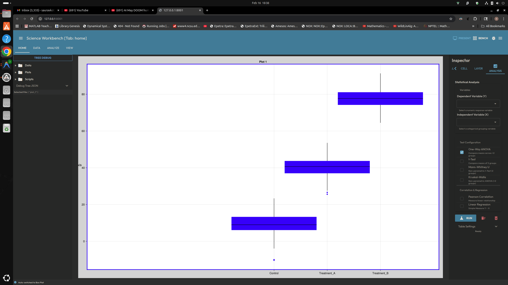
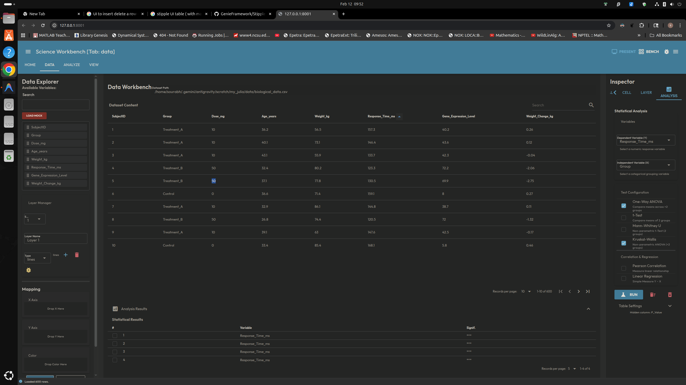
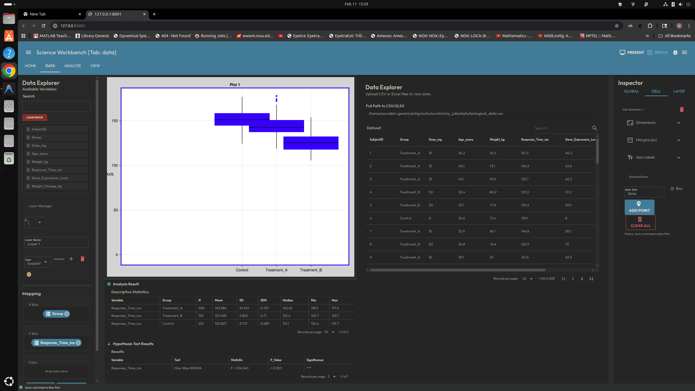

<div align="center">

<h1>Julytics</h1>
<p><strong>Interactive data visualization and analysis platform built with Julia</strong></p>


</div>

> **⚠️ Alpha — Active Development**
> Julytics is currently in alpha. Core features are functional but the API, UI, and data formats are subject to change. Feedback and bug reports are welcome.

---

## 🎬 Demo

> Click the image below to watch the demo video.

<div align="center">
  <video src="https://github.com/user-attachments/assets/e9a7471f-448b-4516-bca0-6d5a32c07ae0" controls width="85%"></video>
    
  </a>
  <br/>
  <sub>▶ Click to watch demo</sub>
</div>

---

## What is Julytics?

Julytics is a browser-based data exploration and charting platform powered by Julia. It combines the numerical performance of Julia with a reactive web UI, enabling smooth, GPU-accelerated interactive plots — all without leaving the browser.

Built for analysts who want the power of a full programming language with the immediacy of a drag-and-drop interface.

---

## Screenshots

<table>
  <tr>
    <td align="center">
      
      <sub><b>Data Explorer — Drag-and-drop column mapping with live preview</b></sub>
    </td>
    <td align="center">
      
      <sub><b>Bench Mode — Multi-panel analysis layout</b></sub>
    </td>
  </tr>
</table>

---

## Key Features

### 🎨 Interactive Plotting
- **GPU-accelerated rendering** via WGLMakie (WebGL) — smooth 60 FPS pan/zoom
- **Multiple chart types** — line, scatter, bar, boxplot
- **Smart layer diffing** — only mutates scene objects that actually changed, avoiding WGLMakie stutter

### 🔍 Data Explorer
- Drag-and-drop axis mapping (X, Y, Color)
- Live column preview with type inference
- Supports CSV and structured data files

### 📝 Annotation System
- Click-to-snap: snaps to the nearest data point
- Dashed leader line with automatic pixel-precise gap from text edge
- Optional text box background (toggle on/off per annotation)
- Annotations persist across sessions via JSON config
- **Vectorized Array Buffer architecture**: all annotations share 4 static GPU nodes — zero scene-graph mutations, zero UI stutter on create/delete

### 📐 Flexible Layout
- Multi-subplot grid with configurable rows/columns
- Bench mode for deep-dive analysis
- Presentation mode for clean exports

---

## Tech Stack

| Layer | Technology |
|-------|-----------|
| Language | [Julia](https://julialang.org/) |
| Plotting | [WGLMakie](https://docs.makie.org/stable/) — WebGL via Observables |
| Reactive UI | [Genie.jl](https://genieframework.com/) + [Stipple.jl](https://github.com/GenieFramework/Stipple.jl) |
| Frontend | Vue 3 (managed by Stipple) |
| Persistence | JSON config snapshots with content-hash deduplication |

---

## Architecture Highlights

### Vectorized Annotation Buffer
Rather than creating and deleting Makie plot objects per annotation (which causes WebSocket serialization overhead and GPU stuttering), Julytics uses four **persistent static nodes** bound to shared `Observable{Vector}` arrays:

```
VA_ANC  — scatter!       anchor dots   (data space)
VA_LINE — linesegments!  leader lines  (data space, pixel-gap computed)
VA_BOX  — poly!          text boxes    (pixel space)
VA_TXT  — text!          labels        (data space)
```

All annotation CRUD operations update the arrays in-place. Zero scene-graph mutations after initialization.

### Smart Layer Diffing
The plotting backend compares incoming layer configs against existing scene objects by label ID before re-rendering. Only changed layers are redrawn — unchanged layers are left untouched on the GPU.

---

## A Note on AI-Assisted Development

This project was built with the assistance of AI coding tools. However, to ensure **reliability, correctness, and performance**, every AI-generated contribution was subject to:

- ✅ Manual code review and architectural audit
- ✅ Rigorous testing of edge cases and interaction states
- ✅ Performance profiling and regression checks
- ✅ Domain-specific validation of numerical and rendering correctness

AI was used as a productivity accelerator — all design decisions, trade-off evaluations, and quality gates were driven by human judgement.

---

## Source Code

The full source is maintained in a **private repository**. If you are interested in collaboration, licensing, or a deeper technical walkthrough, feel free to reach out.

---

<div align="center">
  <sub>Built with ❤️ using Julia — Alpha release, actively developed</sub>
</div>
